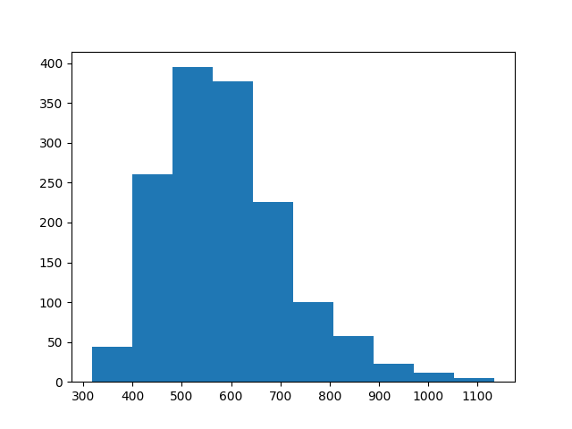
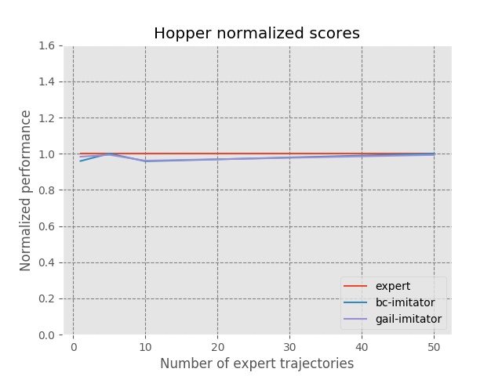
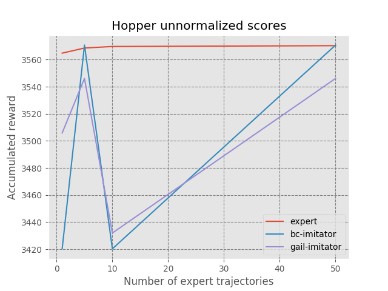
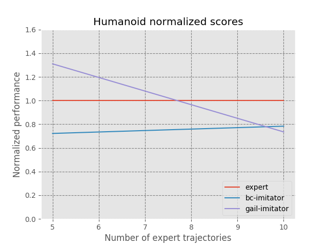
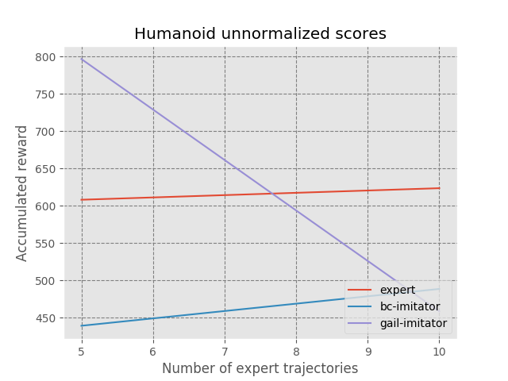
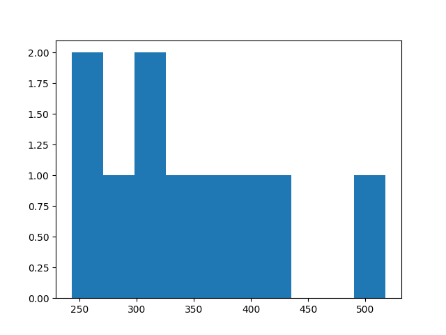
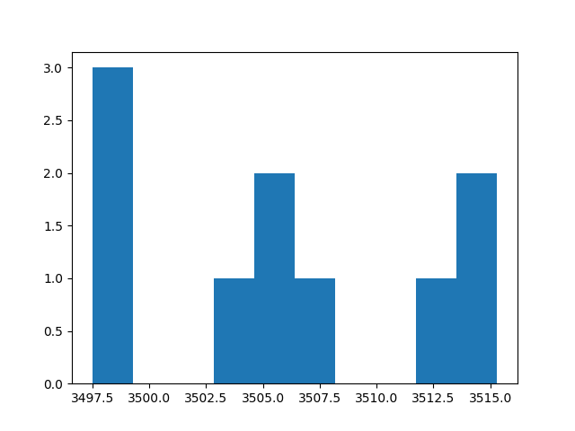
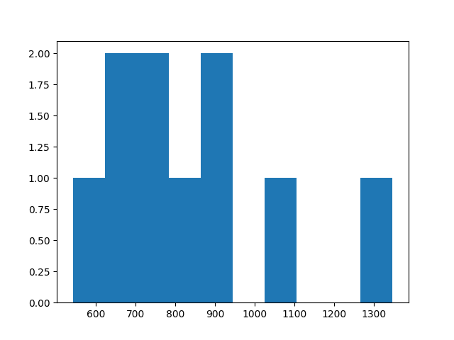
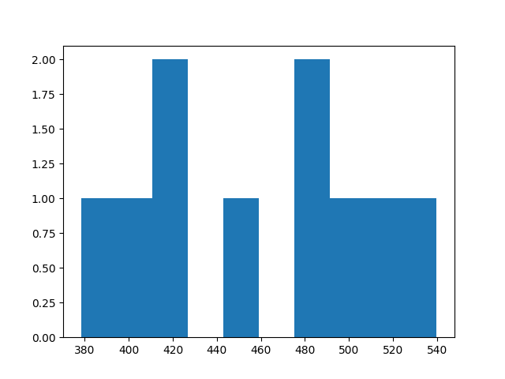

# MuJoCo Training on Generative Adversarial Imitation Learning (GAIL) 


## Create Environment on Ubuntu 18.04, MuJoCo 1.31, mujoco-py==0.5.7, gym==0.8.1, Python 3.5
Install MuJoCo 1.31

Create Conda Environment with Python 3.5
```
conda env create -f environment.yml
source activate gail-mujoco
```
Download gym 0.8.1 5f8d1fc1c6ea8a7dab44fcdab8a4ac1c24ba6759
pip install -e .


## Download Expert Data
create a data directory and download the expert data from [download link](https://drive.google.com/drive/folders/1h3H4AY_ZBx08hz-Ct0Nxxus-V1melu1U?usp=sharing)

## Plot Expert Data
```
python -m mujoco_dset --expert_path=data/deterministic.trpo.Humanoid.0.00.npz --traj_limitation=-1 --plot=True
```
Returns from 10 Trajectories of Humanoid with Trajectory Limitation of -1:



## Run GAIL training on Hopper
```
python -m baselines.gail.run_mujoco
python -m baselines.gail.run_mujoco --traj_limitation=1
python -m baselines.gail.run_mujoco --traj_limitation=5
python -m baselines.gail.run_mujoco --traj_limitation=10
python -m baselines.gail.run_mujoco --traj_limitation=50
```

## Run BC training on Hopper
```
python -m behavior_clone --env_id=Hopper-v2
python -m behavior_clone --env_id=Hopper-v2 --traj_limitation=1
python -m behavior_clone --env_id=Hopper-v2 --traj_limitation=5
python -m behavior_clone --env_id=Hopper-v2 --traj_limitation=10
python -m behavior_clone --env_id=Hopper-v2 --traj_limitation=50
```

## Create Hopper Charts
```
python -m gail-eval --env=Hopper
```





## Run GAIL training on Humanoid
```
python -m baselines.gail.run_mujoco --traj_limitation=5 --env_id=Humanoid-v2 --expert_path=data/deterministic.trpo.Humanoid.0.00.npz
python -m baselines.gail.run_mujoco --traj_limitation=10 --env_id=Humanoid-v2 --expert_path=data/deterministic.trpo.Humanoid.0.00.npz
```

## Run BC training on Humanoid
```
python -m behavior_clone --traj_limitation=5 --env_id=Humanoid-v2 --expert_path=data/deterministic.trpo.Humanoid.0.00.npz
python -m behavior_clone --traj_limitation=10 --env_id=Humanoid-v2 --expert_path=data/deterministic.trpo.Humanoid.0.00.npz
```
## Create Humanoid Charts
```
python -m gail-eval --env=Humanoid
```






## Run GAIL training on HumanoidStandup
```
python -m baselines.gail.run_mujoco --traj_limitation=5 --env_id=HumanoidStandup-v1 --expert_path=data/deterministic.trpo.HumanoidStandup.0.00.npz
python -m baselines.gail.run_mujoco --traj_limitation=50 --env_id=HumanoidStandup-v1 --expert_path=data/deterministic.trpo.HumanoidStandup.0.00.npz
```

## Run BC training on HumanoidStandup
```
python -m behavior_clone --traj_limitation=5 --env_id=HumanoidStandup-v1 --expert_path=data/deterministic.trpo.HumanoidStandup.0.00.npz
TODO: python -m behavior_clone --traj_limitation=50 --env_id=HumanoidStandup-v1 --expert_path=data/deterministic.trpo.HumanoidStandup.0.00.npz
```
## Create HumanoidStandup Charts
```
TODO: python -m gail-eval --env=HumanoidStandup
```


## Evaluate Hopper
```
python -m baselines.gail.run_mujoco --task evaluate --save_sample --load_model_path   checkpoint/trpo_gail.transition_limitation_-1.Hopper.g_step_3.d_step_1.policy_entcoeff_0.adversary_entcoeff_0.001.seed_0/trpo_gail.transition_limitation_-1.Hopper.g_step_3.d_step_1.policy_entcoeff_0.adversary_entcoeff_0.001.seed_0
```
```
python -m mujoco_dset --expert_path=trpo_gail.transition_limitation_-1.Hopper.g_step_3.d_step_1.policy_entcoeff_0.adversary_entcoeff_0.001.seed_0.Hopper-v2.npz --traj_limitation=-1 --plot=True
```
Returns from 10 Trajectories of Hopper with Trajectory Limitation of -1:



```
python -m baselines.gail.run_mujoco --task evaluate --save_sample --load_model_path  checkpoint/trpo_gail.transition_limitation_1.Hopper.g_step_3.d_step_1.policy_entcoeff_0.adversary_entcoeff_0.001.seed_0/trpo_gail.transition_limitation_1.Hopper.g_step_3.d_step_1.policy_entcoeff_0.adversary_entcoeff_0.001.seed_0
```
```
python -m mujoco_dset --expert_path=trpo_gail.transition_limitation_1.Hopper.g_step_3.d_step_1.policy_entcoeff_0.adversary_entcoeff_0.001.seed_0.Hopper-v2.npz --traj_limitation=-1 --plot=True
```
Returns from 10 Trajectories of Hopper with Trajectory Limitation of 10:




## Evaluate and Plot Humanoid
```
python -m baselines.gail.run_mujoco --env_id=Humanoid-v2 --task evaluate --save_sample --load_model_path   checkpoint/trpo_gail.transition_limitation_5.Humanoid.g_step_3.d_step_1.policy_entcoeff_0.adversary_entcoeff_0.001.seed_0/trpo_gail.transition_limitation_5.Humanoid.g_step_3.d_step_1.policy_entcoeff_0.adversary_entcoeff_0.001.seed_0
```
```
python -m mujoco_dset --expert_path=trpo_gail.transition_limitation_5.Humanoid.g_step_3.d_step_1.policy_entcoeff_0.adversary_entcoeff_0.001.seed_0.Humanoid-v2.npz --traj_limitation=-1 --plot=True
```
Returns from 10 Trajectories of Humanoid with a Trajectory Limitation of 5:



```
python -m baselines.gail.run_mujoco --env_id=Humanoid-v1 --task evaluate --save_sample --load_model_path   checkpoint/trpo_gail.transition_limitation_10.Humanoid.g_step_3.d_step_1.policy_entcoeff_0.adversary_entcoeff_0.001.seed_0/trpo_gail.transition_limitation_10.Humanoid.g_step_3.d_step_1.policy_entcoeff_0.adversary_entcoeff_0.001.seed_0
```
```
python -m mujoco_dset --expert_path=trpo_gail.transition_limitation_10.Humanoid.g_step_3.d_step_1.policy_entcoeff_0.adversary_entcoeff_0.001.seed_0.Humanoid-v1.npz --traj_limitation=-1 --plot=True
```
Returns from 10 Trajectories of Humanoid with a Trajectory Limitation of 10:




## GAIL Training Logs from Yuan-Hong Liao
[https://drive.google.com/drive/folders/1nnU8dqAV9i37-_5_vWIspyFUJFQLCsDD]


## DO NOT DO THIS, Visualization Fails. Create Environment on Ubuntu 18.04, MuJoCo 1.50, Python 3.5
Install MuJoCo 1.50
```
mkdir -p /root/.mujoco \
    && wget https://www.roboti.us/download/mjpro150_linux.zip -O mujoco.zip \
    && unzip mujoco.zip -d /root/.mujoco \
    && rm mujoco.zip
COPY ./mjkey.txt /root/.mujoco/
ENV LD_LIBRARY_PATH /root/.mujoco/mjpro150/bin:${LD_LIBRARY_PATH}
```

To fix ```fatal error: GL/osmesa.h: No such file or directory``` install:

```
sudo apt-get install libosmesa6-dev
```

Create Conda Environment with Python 3.5
```
conda env create -f environment.yml
source activate gail-mujoco
```

Setup works well until rendering with Monitor.wrapper, https://github.com/openai/mujoco-py/issues/44:
```
ERROR: GLEW initalization error: Missing GL version
```

To fix:
```
export LD_PRELOAD=/usr/lib/x86_64-linux-gnu/libGLEW.so.2.0:/usr/lib/x86_64-linux-gnu/libGL.so
```

Visualization still failed, reverted to MuJoCo 1.31


